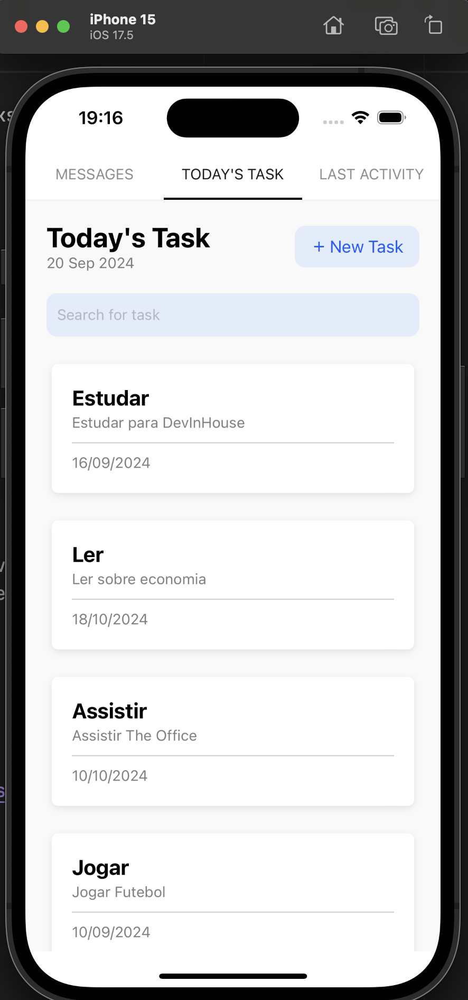

# Task App

Este é um projeto em **React Native** a respeito das suas tasks/tarefas

## Projeto



## Funcionalidades

- Exibição das suas tarefas diárias **today's task**.
- **Descrição** sobre a tarefa.
- **Data** adicionada da tarefas.
- **Butão para criar nova tarefa**.

## Tecnologias Utilizadas

- **React Native**: Framework para desenvolvimento mobile.
- **JavaScript**: Linguagem principal utilizada para desenvolvimento.
- **Expo**: Ferramenta para simplificar o desenvolvimento e testes do app.

## Instalação e Execução

1. Clone o repositório:

   ```bash
   git clone https://github.com/henriquetorrescampos/new-tasks.git
   npm install
   npx expo start / npm run start
   ```
